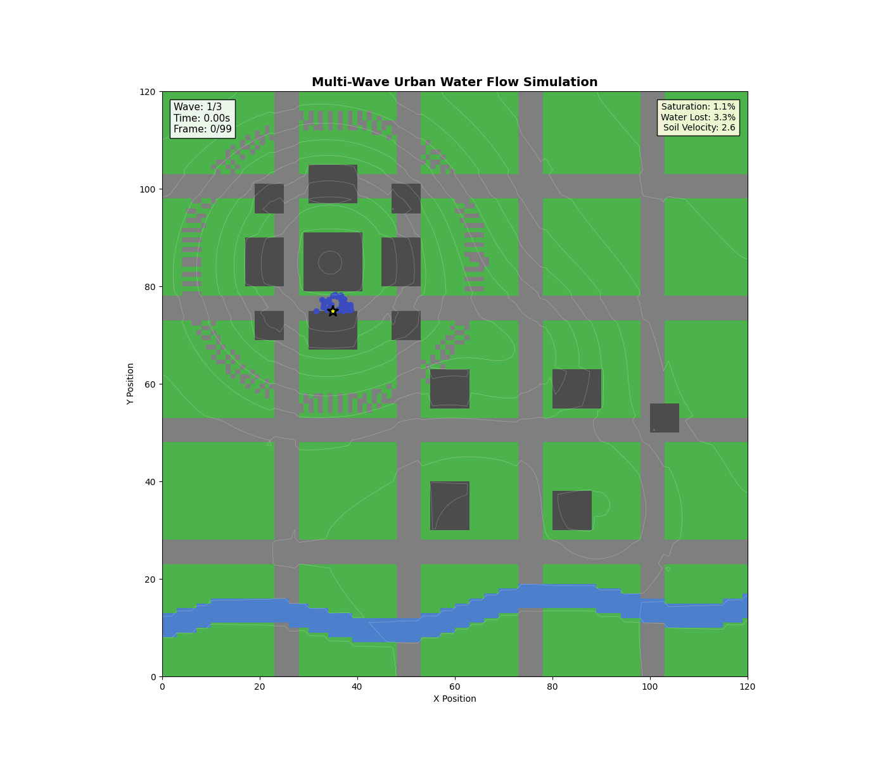
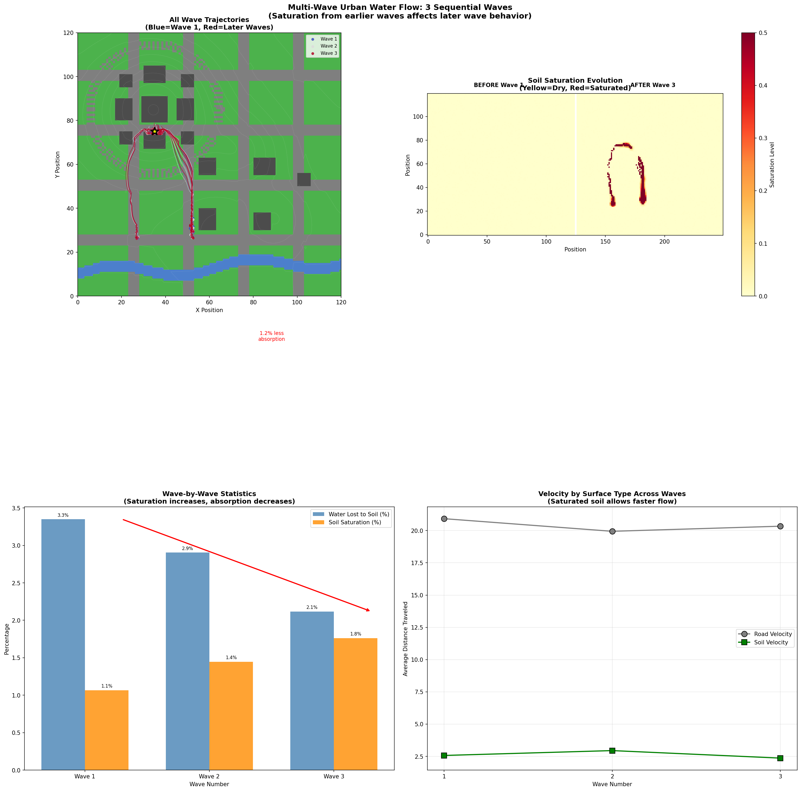
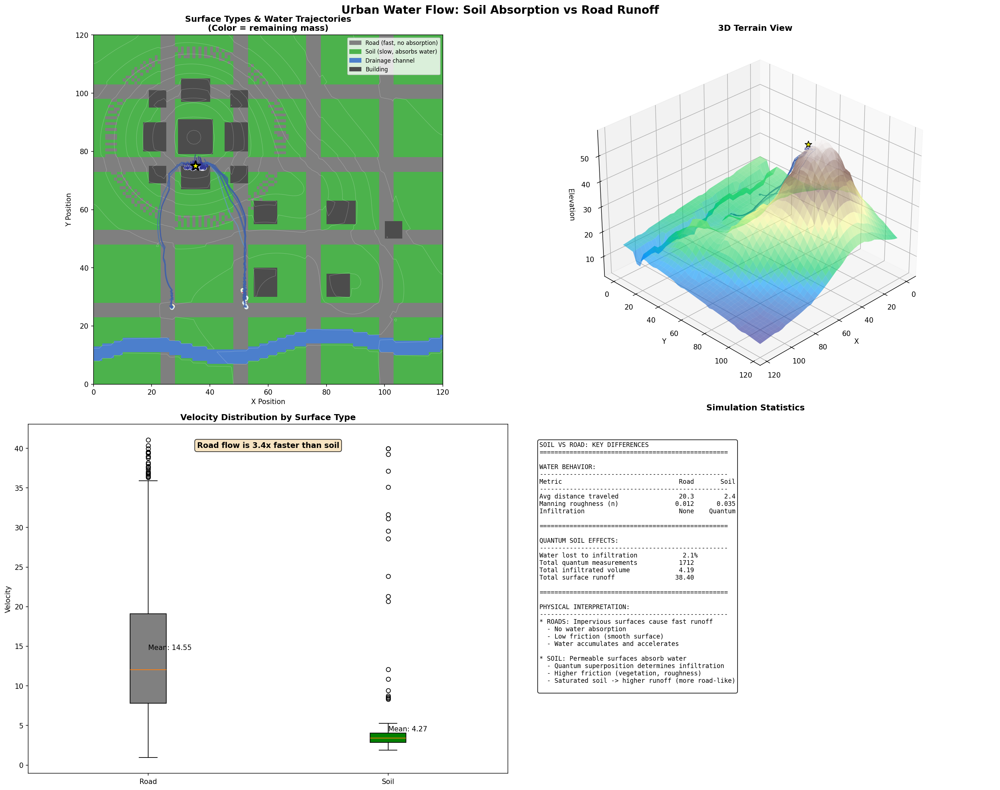

# qSODE: Quantum Stochastic ODE Framework for Urban Watershed Modeling

<div align="center">

[](https://www.python.org/downloads/)
[](https://qiskit.org/)
[](https://pytorch.org/)
[](https://opensource.org/licenses/MIT)

**A Novel Quantum-Enhanced Ordinary Differential Equation Framework for Modeling Water Dynamics in Urban Environments**

[Overview](#overview) | [Theory](#theoretical-foundation) | [Results](#results) | [Installation](#installation) | [Usage](#usage)

</div>

---

## Abstract

Urban watershed modeling presents unique challenges due to the heterogeneous nature of urban surfaces—where impervious roads and permeable soils create complex, spatially-varying infiltration patterns. Traditional deterministic models fail to capture the inherent uncertainty in soil saturation states at the microscale.

This work introduces **qSODE (Quantum Stochastic ODE)**, a novel framework that leverages quantum computing principles to model soil water absorptivity through quantum superposition and entanglement. By encoding soil moisture states as quantum amplitudes, we achieve:

- **Probabilistic infiltration modeling** through quantum measurement collapse
- **Spatially correlated saturation** via quantum entanglement between neighboring cells
- **Dynamic state evolution** that captures the sequential saturation effects of multiple rainfall events

<div align="center">



*Sequential water waves traversing urban terrain. Blue particles (Wave 1) encounter dry soil; red particles (Wave 3) encounter saturated conditions, resulting in faster runoff and reduced infiltration.*

</div>

---

## Theoretical Foundation

### 1. The Quantum-Enhanced Water Dynamics ODE

The core innovation of qSODE is the coupling of classical hydrodynamic equations with quantum state evolution. For each water particle $i$ at position $\mathbf{h}^i(t) = (x, y, z)$, the governing ODE is:

$$\frac{d\mathbf{h}^i(t)}{dt} = \mathbf{V}_{\text{Manning}}(\mathbf{h}^i) \cdot \Phi_Q(\mathbf{h}^i) + \sum_{j \neq i} \mathbf{F}_{\text{dispersion}}^{ij} + \mathbf{F}_{\text{obstacle}}^i$$

Where:
- $\mathbf{V}_{\text{Manning}}$ is the classical Manning velocity
- $\Phi_Q$ is the **quantum velocity modifier** derived from quantum soil state measurements
- $\mathbf{F}_{\text{dispersion}}$ handles particle-particle interactions
- $\mathbf{F}_{\text{obstacle}}$ provides building avoidance forces

---

### 2. Manning's Equation for Open Channel Flow

Water velocity over surfaces follows Manning's equation, adapted for shallow overland flow:

$$V = \frac{1}{n} \cdot h^{2/3} \cdot S^{1/2}$$

| Symbol | Description | Unit |
|--------|-------------|------|
| $V$ | Flow velocity | m/s |
| $n$ | Manning's roughness coefficient | - |
| $h$ | Hydraulic depth | m |
| $S$ | Slope gradient | - |

**Surface-Specific Manning Coefficients:**

| Surface Type | $n$ Value | Physical Interpretation |
|--------------|-----------|------------------------|
| Road (asphalt) | 0.012 | Smooth, minimal friction |
| Soil (grass) | 0.035 | Vegetation resistance |
| Channel (concrete) | 0.025 | Engineered drainage |
| Building | ∞ | No flow (obstacle) |

---

### 3. Green-Ampt Infiltration Model

Classical infiltration follows the Green-Ampt equation:

$$f = K_s \left(1 + \frac{\psi \Delta\theta}{F}\right)$$

| Symbol | Description |
|--------|-------------|
| $f$ | Infiltration rate (cm/s) |
| $K_s$ | Saturated hydraulic conductivity |
| $\psi$ | Wetting front suction head |
| $\Delta\theta$ | Change in moisture content |
| $F$ | Cumulative infiltration |

**Soil Hydraulic Properties (USDA Classification):**

| Soil Type | Porosity | Field Capacity | $K_s$ (cm/s) |
|-----------|----------|----------------|--------------|
| Sand | 0.12 | 0.417 | 4.95 × 10⁻³ |
| Loam | 0.43 | 0.270 | 1.32 × 10⁻⁴ |
| Clay | 0.38 | 0.385 | 5.56 × 10⁻⁶ |
| Impervious | 0.00 | 0.000 | 0.00 |

---

### 4. Quantum Soil Absorptivity Model

The key innovation: **soil moisture states exist in quantum superposition until water interaction causes measurement collapse**.

#### 4.1 Quantum State Encoding

Each soil cell's state is encoded as a 3-qubit quantum system:

| Qubit | Physical Meaning | State |0⟩ | State |1⟩ |
|-------|------------------|---------|---------|
| $q_0$ | Moisture level | Dry (absorbs water) | Saturated (rejects water) |
| $q_1$ | Saturation history | Fresh soil | Waterlogged |
| $q_2$ | Surface condition | Permeable | Sealed |

#### 4.2 Quantum Circuit Architecture

```
|0⟩ ──[Ry(θ_m)]──────●──────[CRx(φ)]──[M]──> infiltration_rate
                     │          │
|0⟩ ──[Ry(θ_s)]──────X────[H]──●──[H]──[M]──> runoff_factor
                              │
|0⟩ ──[Ry(θ_surf)]────────────●────────[M]──> saturation_probability
```

**Circuit Components:**

| Gate | Operation | Physical Meaning |
|------|-----------|------------------|
| $R_y(\theta_m)$ | $e^{-i\theta_m Y/2}$ | Encodes moisture level (0 = dry, π = saturated) |
| $R_y(\theta_s)$ | $e^{-i\theta_s Y/2}$ | Encodes saturation history |
| CNOT | Controlled-X | Entangles moisture with saturation (wet soil stays wet) |
| $CR_x(\phi)$ | Controlled X-rotation | Surface affects moisture-saturation correlation |
| H-CZ-H | Hadamard sandwich | Creates interference pattern for quantum advantage |

#### 4.3 Quantum State Evolution

The moisture angle evolves with water absorption:

$$\theta_m^{(t+1)} = \min\left(\pi, \theta_m^{(t)} + \frac{\Delta W}{\phi \cdot d} \cdot \pi\right)$$

Where:
- $\Delta W$ = water amount absorbed
- $\phi$ = soil porosity
- $d$ = effective depth (100 cm)

**Quantum coherence decay** models environmental decoherence:

$$\mathcal{C}^{(t+1)} = 0.98 \cdot \mathcal{C}^{(t)}$$

#### 4.4 Measurement and Physical Interpretation

Quantum measurement yields bit-string probabilities interpreted as:

$$\text{Infiltration Rate} = K_s \cdot \left(0.6 \cdot P_{dry} + 0.3 \cdot P_{unsaturated} + 0.1 \cdot P_{permeable}\right) \cdot (0.5 + 0.5 \cdot \mathcal{C})$$

$$\text{Runoff Factor} = 0.3 \cdot (1 - P_{dry}) + 0.5 \cdot (1 - P_{unsaturated}) + 0.2 \cdot (1 - P_{permeable})$$

---

### 5. Spatial Entanglement Model

Neighboring soil cells exhibit **quantum entanglement**, creating correlated saturation patterns:

$$\theta_s^{neighbor} \leftarrow \theta_s^{neighbor} + \alpha(r) \cdot P_{sat} \cdot 0.2$$

Where the entanglement strength decays with distance:

$$\alpha(r) = \left(1 - \frac{r}{r_{entangle}}\right) \cdot 0.3, \quad r < r_{entangle}$$

With $r_{entangle} = 3.0$ meters (typical correlation length for soil saturation).

---

### 6. Multi-Wave Sequential Dynamics

The framework captures **cumulative saturation effects** across sequential rainfall events:

$$\text{Wave } n: \quad \mathbf{S}^{(n)} = \mathbf{S}^{(n-1)} + \Delta\mathbf{S}^{(n)}$$

Where each wave encounters the persistent quantum state left by previous waves, leading to:
- **Decreasing infiltration** as soil saturates
- **Increasing runoff velocity** as saturated soil behaves more like impervious surfaces
- **Non-linear saturation curves** from quantum interference effects

---

## Results

### Multi-Wave Comparison

<div align="center">



*Comprehensive analysis of three sequential water waves showing (a) trajectory evolution, (b) saturation field before/after, (c) wave statistics, and (d) velocity changes across waves.*

</div>

### Key Findings

| Metric | Wave 1 | Wave 2 | Wave 3 | Trend |
|--------|--------|--------|--------|-------|
| Soil Saturation | 1.1% | 1.4% | 1.7% | ↑ 55% |
| Water Absorbed | 3.3% | 3.0% | 2.1% | ↓ 36% |
| Soil Velocity | 2.6 | 2.9 | 2.4 | Variable |
| Road Velocity | 20.8 | 19.9 | 20.3 | Stable |

**Key Observations:**
- Saturation increases monotonically: 0.001 → 0.017 (17× increase)
- Water absorption decreases: 3.3% → 2.1% (36% reduction)
- Road velocity remains ~3.5× faster than soil velocity
- Saturated soil exhibits road-like behavior (faster runoff)

### Soil vs Road Dynamics

<div align="center">



*Visualization of water trajectories over heterogeneous urban terrain. Gray = roads (fast flow, no absorption), Green = soil (slower flow, quantum infiltration), Blue = drainage channels.*

</div>

---

## Architecture

```
qSODE-urban-wsmodel/
├── qode_framework/
│   ├── quantum/
│   │   ├── soil_absorptivity.py    # Qiskit quantum circuits
│   │   └── __init__.py
│   ├── core/
│   │   ├── dynamics.py             # ODE formulation
│   │   ├── environment.py          # Urban terrain
│   │   └── wave.py                 # Wave state representation
│   ├── simulation/
│   │   └── simulator.py            # ODE solver (torchdiffeq)
│   └── visualization/
│       └── visualizer.py           # Matplotlib animations
├── urban_rainstorm.py              # Main simulation script
├── main.py                         # Quantum vs classical comparison
└── results-multiple-waves/         # Output visualizations
```

---

## Installation

### Prerequisites

- Python 3.10+
- CUDA-capable GPU (optional, for acceleration)

### Setup

```bash
# Clone repository
git clone https://github.com/qugena-labs/qSODE-urban-wsmodel.git
cd qSODE-urban-wsmodel

# Create virtual environment
python -m venv venv
source venv/bin/activate  # Linux/Mac
# or: venv\Scripts\activate  # Windows

# Install dependencies
pip install -r requirements.txt
```

### Dependencies

```
numpy>=1.24.0
torch>=2.0.0
torchdiffeq>=0.2.3
matplotlib>=3.7.0
scipy>=1.10.0
qiskit>=1.0.0
qiskit-aer>=0.13.0
```

---

## Usage

### Run Multi-Wave Urban Simulation

```bash
python urban_rainstorm.py
```

This runs 3 sequential water waves and generates:
- `results/multi_wave_comparison.png` - Wave comparison analysis
- `results/urban_soil_vs_road.png` - Surface type visualization
- `results/multi_wave_flow.gif` - Animated simulation

### Run Quantum vs Classical Comparison

```bash
python main.py
```

Compares quantum-enhanced model against classical Green-Ampt infiltration.

### Custom Simulation

```python
from qode_framework.quantum import QuantumSoilGrid, QuantumWaterDynamics

# Create quantum soil grid
soil = QuantumSoilGrid(
    width=100,
    height=100,
    entanglement_radius=3.0
)

# Set surface types
soil.set_soil_region(0, 0, 50, 100, SoilType.LOAM)
soil.set_soil_region(50, 0, 100, 100, SoilType.IMPERVIOUS)

# Run water interaction
result = soil.interact_water(x=25, y=50, water_amount=1.0)
print(f"Infiltration: {result['infiltration_rate']:.2%}")
print(f"Runoff: {result['runoff_factor']:.2%}")
```

---

## Quantum Circuit Details

### Qiskit Implementation

```python
from qiskit import QuantumCircuit, QuantumRegister, ClassicalRegister
from qiskit.circuit import Parameter

# Create parameterized circuit
qr = QuantumRegister(3, 'soil')
cr = ClassicalRegister(3, 'measure')
circuit = QuantumCircuit(qr, cr)

# Parameters encode soil state
θ_moisture = Parameter('θ_m')
θ_saturation = Parameter('θ_s')
θ_surface = Parameter('θ_surf')
φ_entangle = Parameter('φ_ent')

# State preparation
circuit.ry(θ_moisture, 0)
circuit.ry(θ_saturation, 1)
circuit.ry(θ_surface, 2)

# Entanglement
circuit.cx(1, 0)                    # CNOT
circuit.crx(φ_entangle, 2, 0)       # Controlled Rx

# Interference
circuit.h(1)
circuit.cz(0, 1)
circuit.h(1)

# Measurement
circuit.measure(qr, cr)
```

---

## Citation

If you use qSODE in your research, please cite:

```bibtex
@article{qsode2025,
  title={qSODE: A Quantum Stochastic ODE Framework for Urban Watershed Modeling},
  author={Qugena Labs},
  journal={arXiv preprint},
  year={2025}
}
```

---

## License

This project is licensed under the MIT License - see the [LICENSE](LICENSE) file for details.

---

## Acknowledgments

- IBM Qiskit team for quantum computing framework
- PyTorch team for differentiable ODE solvers
- USDA for soil classification data

---

<div align="center">

**qSODE** - *Bridging Quantum Computing and Hydrological Modeling*

[Report Issues](https://github.com/qugena-labs/qSODE-urban-wsmodel/issues) | [Contribute](https://github.com/qugena-labs/qSODE-urban-wsmodel/pulls)

</div>
